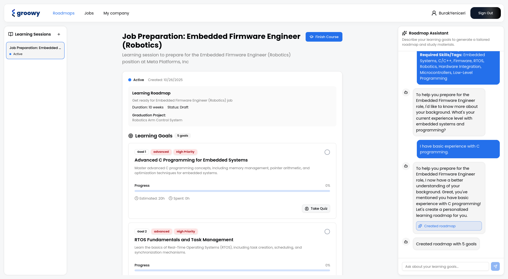
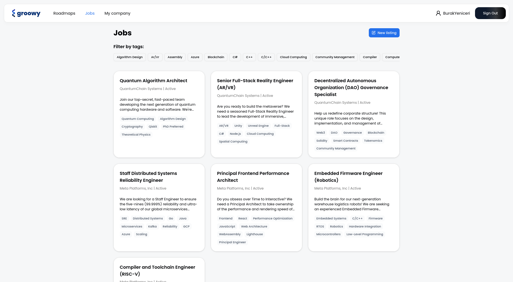
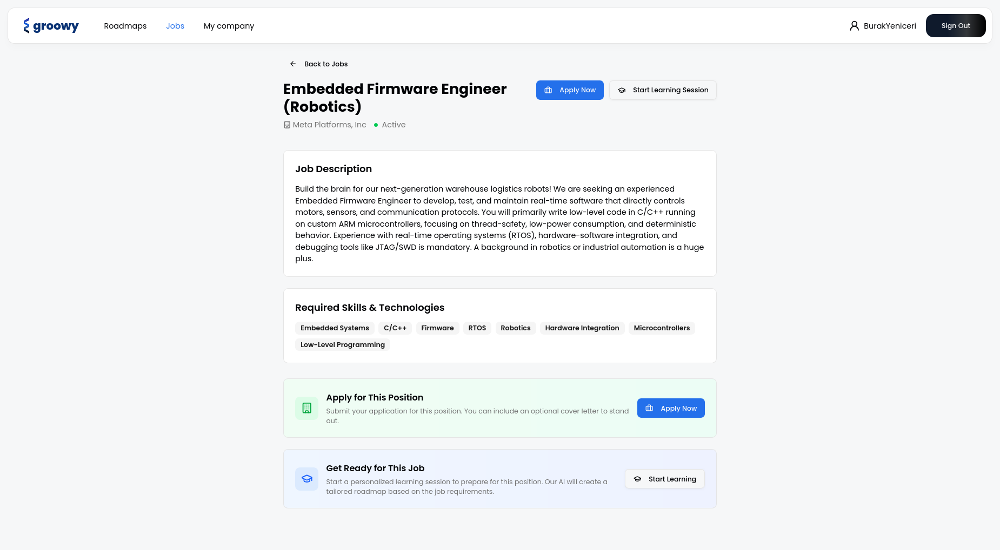
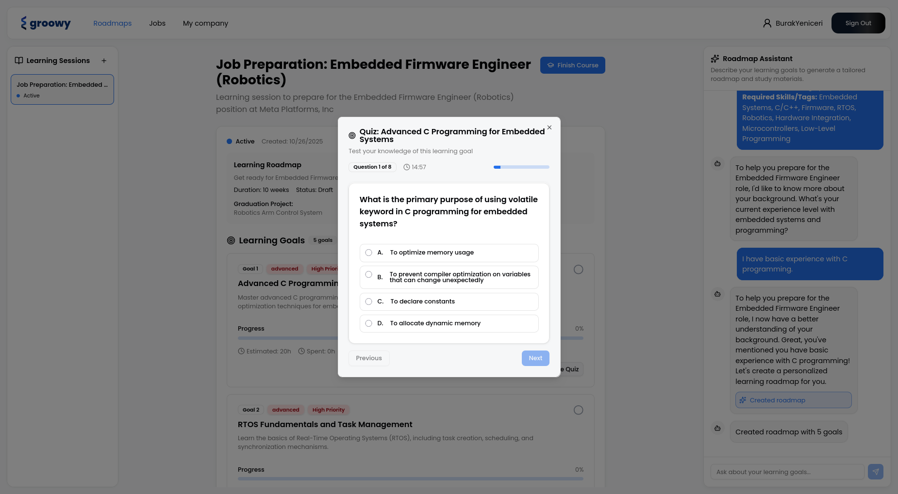

# Groowy - Where skills meet their future.

Groowy is an innovative platform connecting employers and job seekers, focusing on personalized career development through AI-driven learning and transparent progress tracking. It integrates job applications with customized training courses.

Job seekers can create Personalized Roadmaps based on their goals, track their development (which is LLM-staged), and test their skills. Crucially, employers can view applicants' progress, completed courses, and project-based theses, leading to more informed hiring decisions.

# Installation instructions
This project consists of a monolithic backend API, a microservice and a frontend application.

Each of these projects must be built for a reliable deployment. 

The included [build.sh](./build.sh) script in the repository root will automatically build the frontend, backend and AI service - and place them in the `dist/` directory.

The backend application runs on TCP port 8080, the AI service runs on TCP port 8000, and the frontend is a static bundle. The backend must be served under the same host under the frontend, and it must be proxied under the `/api` route. The included [nginx.conf](./nginx.conf) file already handles this, however you should change the `root` directive to match the location of the static frontend assets.

The backend can be ran directly with `java -jar` alongisde other JVM arguments you wish.

The AI microservice must be ran inside a Python virtual environment. The included build script automatically creates the virtual environment and installs dependencies, so you only need to run `uvicorn main:app` inside the venv.

# Usage guide
## Account creation
Navigate to the `/signup` route to create an account.
Choose your desired role (job hunter or recruiter) and fill in the required fields.

If you choose a recruiter account, a company profile will be automatically created for you - which can be edited from your company's profile page.

## AI roadmaps and job preparation
Create a learning session to learn any skill with plans and quizzes. Click on the `+` sign, name your learning space, then let AI handle the rest for you in a friendly chat window.

Ask the AI to create roadmaps or materials - or refine your existing roadmap. The changes will be reflected immediately to the left pane.

## Job listings
Find jobs to apply for. You can choose any job listing from the list, and click on the `Apply` button to apply for it. If you signed up as a recruiter, you can create job listings.

Additionally, you can choose to start a learning session immediately from a job listing. The job description will be immediately forwarded to AI beforehand.

## Company profiles
If you are a recruiter representing a company, you can create a company profile. This will be visible to job seekers, and can be edited from your company profile page.

You can view other company profiles by clicking their names in job listings as well.

## Technologies used
- Llama4 Mavercik
- React, TailwindCSS, React Router
- Spring Boot
- PostgreSQL
- FastAPI

## Team members

- **Sezai Emre Konuk:** Data/ML, worked in the development of the AI microservice. Additionally developed the landing page.
- **Seçkin Özek:** Data/ML, worked in the development of the AI microservice.
- **Dilara İnce:** Design, did UI/UX designs and prepared presentation material as well as the brand identity.
- **Burak Yeniçeri:** Developer, worked in the development of the frontend and backend applications.

## Screenshots

